# Shock Severity Infimum Method
This algorithm addresses the fundamental challenge in shock testing: measuring the severity of a mechanical shock environment.
The shock response of devices is generally acknowledged to be nearly impossible to calculate with complete accuracy.
In this context, the shock response spectrum (SRS) serves as the most widely utilized tool for evaluating shock severity.
The response of devices under shock conditions is significantly influenced by the temporal characteristics of shock signals, such as effective duration and initial rise time.
The maximum response of a device can be estimated using the SRS and response spectrum analysis method.
The algorithm provided in this repository calculates the infimum response of devices, termed the Shock Severity Infimum (SSI).
The application of the SSI spectrum is straightforward.
When considering the shock response of devices as a random variable, the SRS and SSI represent the upper and lower limits, respectively.
If the SSI of the test shock equals or exceeds the SRS of the actual shock, the device can be considered safe.
Please read [the paper](https://royalsocietypublishing.org/doi/10.1098/rspa.2019.0694#:~:text=A%20metric%20is%20necessary%20for,Biot%20in%201932%20%5B4%5D.) for more details.

## Disclaimer
This software is published for academic and non-commercial use only.

## Usage
There are two classes in this repository.
The 'acc' class contains time and data information within its properties that describes an acceleration measurement.
The 'acc' class has a method 'srs', that can calculate the shock response spectrum and matrix. 
The results of 'srs' method will be in the form of an 'srs' object.
The 'srs' class is the main class to analyse shock response matrix.

## Example

Here is an example for reproducing the results as shown in the published paper.
The analysis considers a mechanical shock signal directly measured from an accelerometer.
There are four shock signals given in the data.mat, which has the same SRS curve.
As this example is for demonstration purpose, only the 'RVS' shock (a0) is analysed.

The process begins by importing the provided data and constructing an 'acc' object.
The shock signals in 'data.mat' are pre-processed, including segmentation, detrending, downsampling, and alignment to start from time zero.
The shock data should be thoroughly prepared to anticipate and prevent potential exceptions.
Calculate the SRS from the time series, and plot its SRS graph.


```
load('data.mat');
a0 = acc(t,y);
a0.plot;
s0 = a0.srs(100,10);
% Draw SRS from 100 Hz with quality factor Q=10 
s0.plot;
```

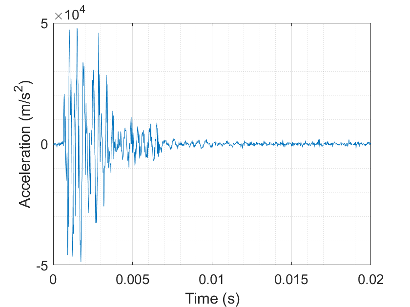
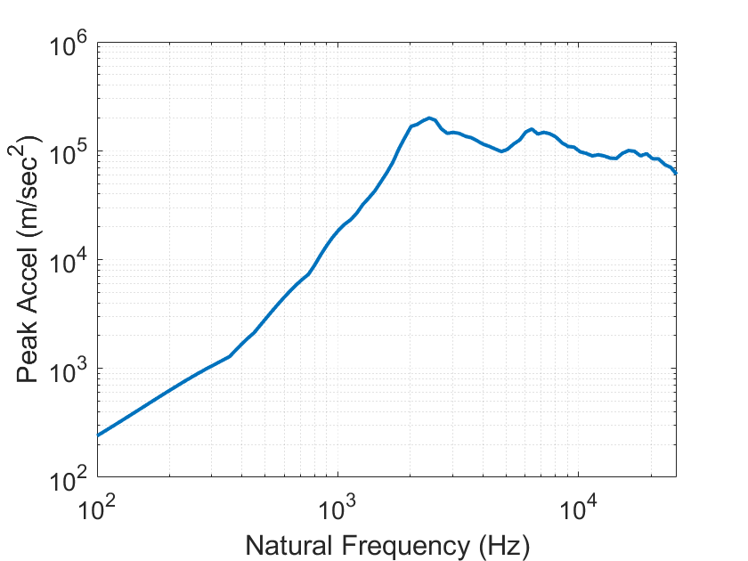

The s0 variable is already structured as an SRS object.
It contains the shock response matrix in its property 'resp'.
The shock response matrix can be visualized using the 'surf' method.
In MATLAB, this visualization is particularly convenient, as the surface plot can be rotated through 3D drag manipulation.
From the surface plot, we can clearly see what the response spectrum is. 
When reducing the order of such a matrix by compressing the time axis into the natural frequency axis and retaining only the absolute maximum values, the resulting reduced-order line represents the well-known SRS plot.
Alternatively, a contour plot of the shock response matrix can be drawn, which provides a convenient visualization method for paper documents.

```
s0.surf;
s0.contourf;
```

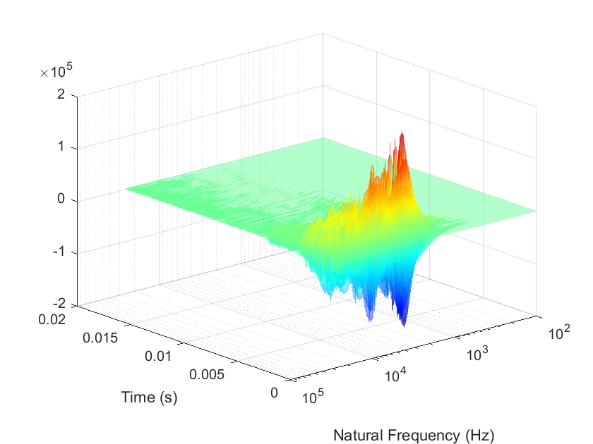
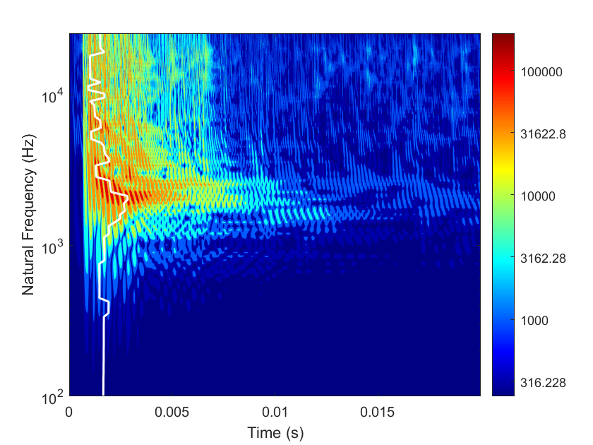

The subsequent analysis step involves decomposing the shock response spectrum.
The 'SVD' method is overridden by a customized function.
Through the input parameter 'k', the method returns the kth decomposed matrix component.
The decomposed matrx component can also be visualized by surface and contour plot.
The first matrix component is of especially importent. 
The surface plot effectively demonstrates the concept of function factorization.
The *n1* represents the product of two single-variate functions, and the time histories maintain identical patterns at each natural frequency while differing only in amplitude.

```
n1 = s0.svd(1);
n1.surf;
n2 = s0.svd(2);
n2.contourf;
```
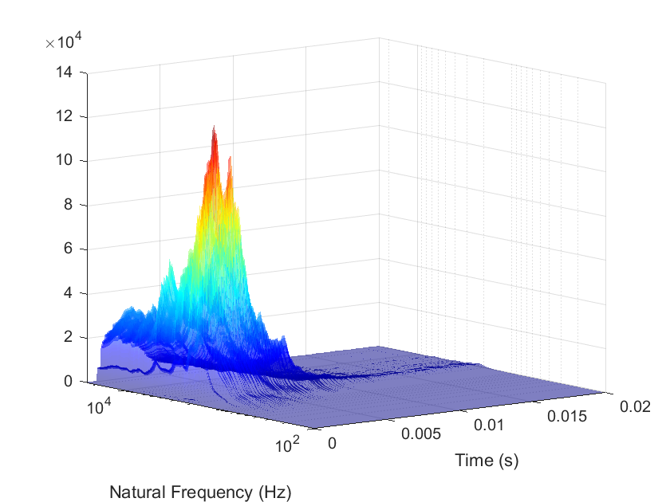
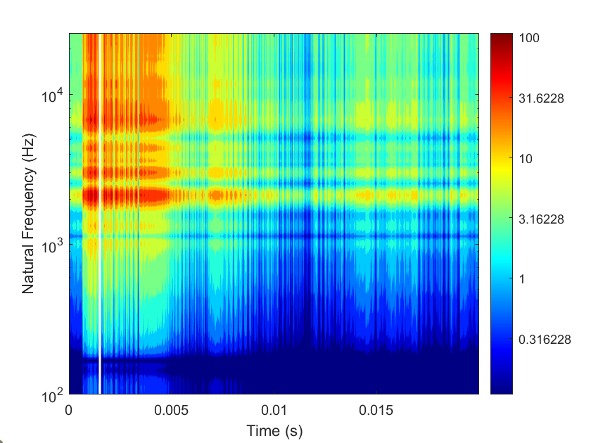

If no output is specified for the svd(k) function, it automatically plots the SSI and SRS spectra along with the margin between them.
For the RVS shock, the SSI demonstrates an average 7 dB safety margin.
This margin value varies among different shocks, depending on the time-frequency characteristics of the shock signals.
The weighted singular vector of the shock response matrix will also be plotted.
```
s0.svd(1);
```
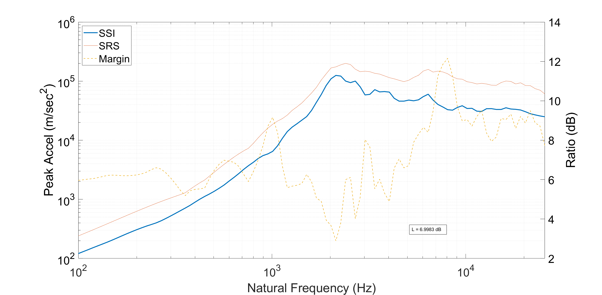
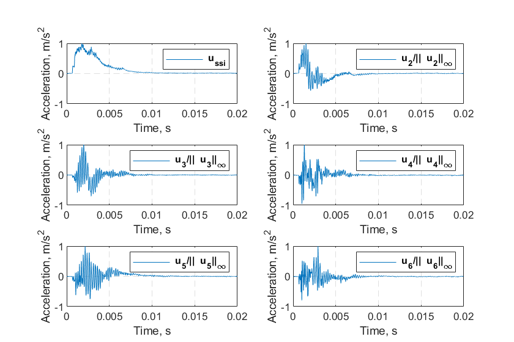

The shock response matrix can be directly used to calculate the structural response of devices.
Using the cantilever beam as example, the modal information of such structures can be calculated by FEM.
In the *srs* class, I also provide a method for response calculation. 

| Natural frequency (Hz)| Modal participation factor | Mode shape|
|-------------------|----------------|--------|
|355.351000000000	|0.0965135000000000	|6.08407000000000|
|355.351000000000	|0.124386000000000	|7.84111000000000|
|2182.83000000000	|-0.0305650000000000	|3.40937000000000|
|2182.83000000000	|-0.0822160000000000	|9.17078000000000|
|4531.28000000000	|4.10373000000000e-12	|1.65699000000000|
|5931.54000000000	|-0.0498803000000000	|-9.23726000000000|
|5931.54000000000	|0.0135566000000000	|2.51050000000000|
|8437.29000000000	|3.47031000000000e-14	|-7.26857000000000e-06|
|11167.5000000000	|0.00920077000000000	|-2.29474000000000|
|11167.5000000000	|-0.0361280000000000	|9.01094000000000|
|13590.6000000000	|-3.50766000000000e-12	|-1.65668000000000|
|17621.4000000000	|-0.0287401000000000	|-8.83793000000000|
|17621.4000000000	|0.00545524000000000	|1.67769000000000|
|22640.2000000000	|-5.40918000000000e-12	|1.65649000000000|
|25019.8000000000	|-0.0218940000000000	|7.88040000000000|
|25019.8000000000	|0.0101241000000000	|-3.64423000000000|
|25287.8000000000	|-4.33338000000000e-13	|-7.27909000000000e-05|

```
[aM, aN] = s0.mdof(MI97);
aM.plot;
aN.plot;
hold on;
[~, aN_] = n1.mdof(MI97);
plot(t, aN_.Data);
```
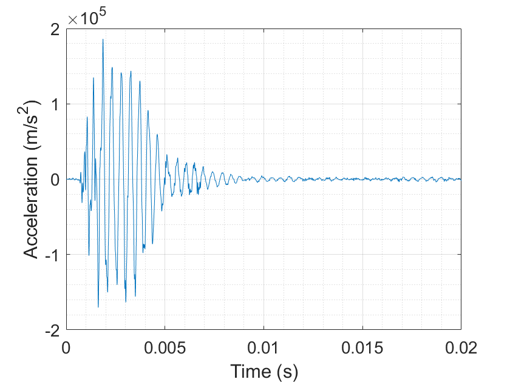
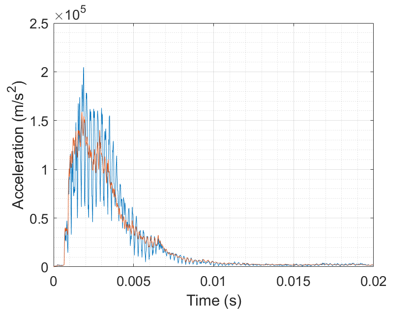

If the SSI of the testing shock is not less than the SRS of the real shock, then the device is believed to be safe.
However, this method might be overly conservative.
The conservativeness can be reduced by reconstructing the shock response matrix with more components.
For example, when reconstructing the shock response spectrum with 5 SVD components, the SSI method yields an average 3.8 dB margin.
When reconstructing the response matrix with 15 SVD components, the SSI method produces an average 1.6 dB margin.

```
s0.svd(1:5);
s0.svd(1:15);
```
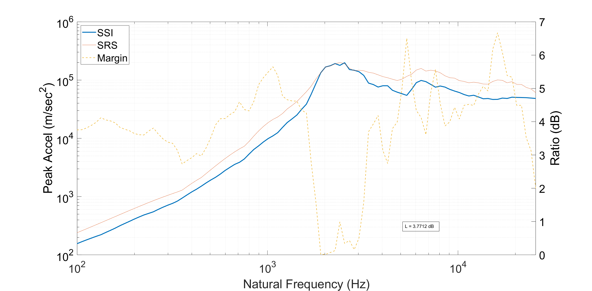
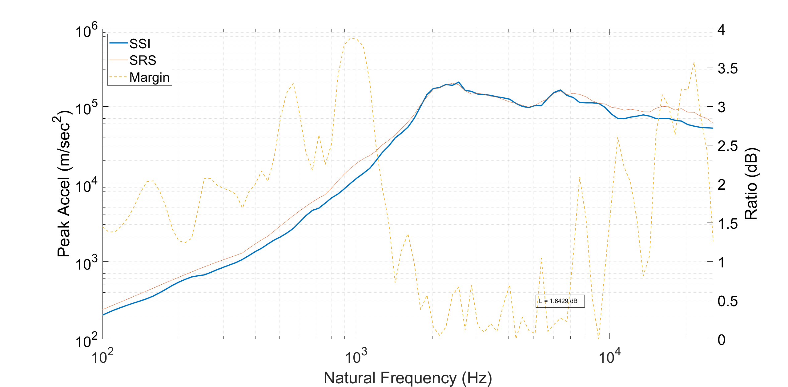

## Citation
If you find this study useful for your research, please cite:
```
@article{Yan2020b,
  title = {Metric of Shock Severity},
  author = {Yan, Yinzhong and Li, Q. M.},
  year = {2020},
  journal = {Proceedings of the Royal Society A: Mathematical, Physical and Engineering Sciences},
  volume = {476},
  number = {2239},
  pages = {20190694},
}
```

## Contact
Feel free to contact me at [yan.yinzhong@outlook.com](mailto:yan.yinzhong@outlook.com).
